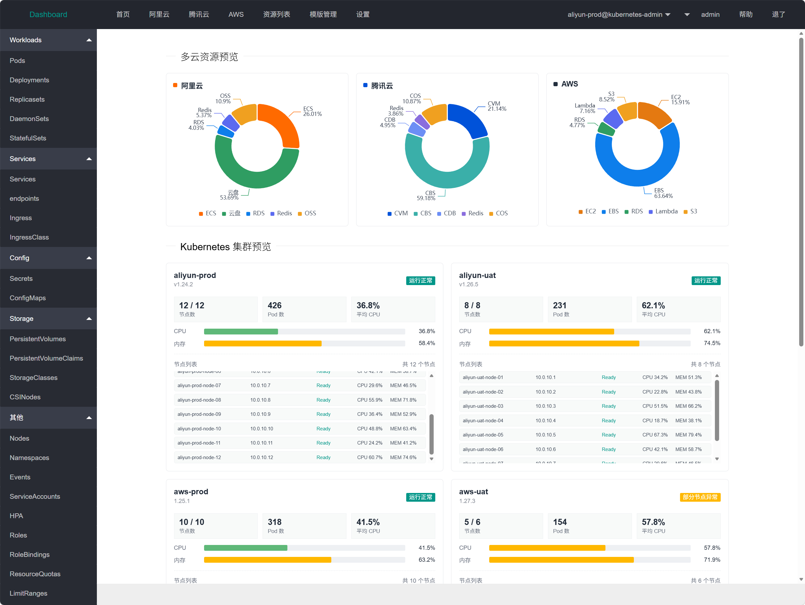
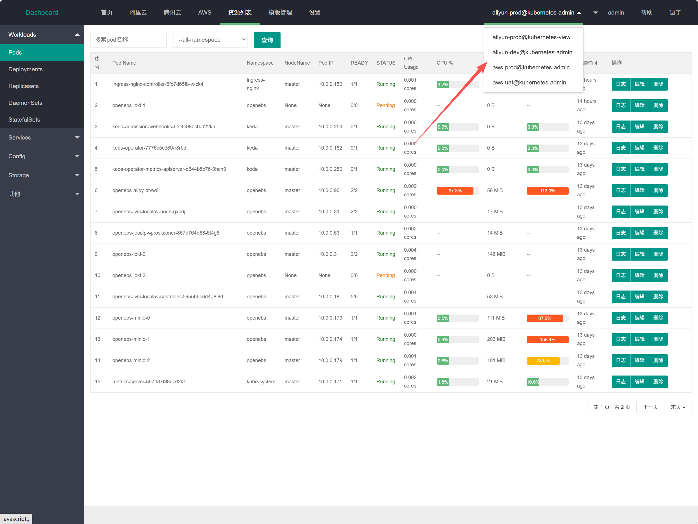
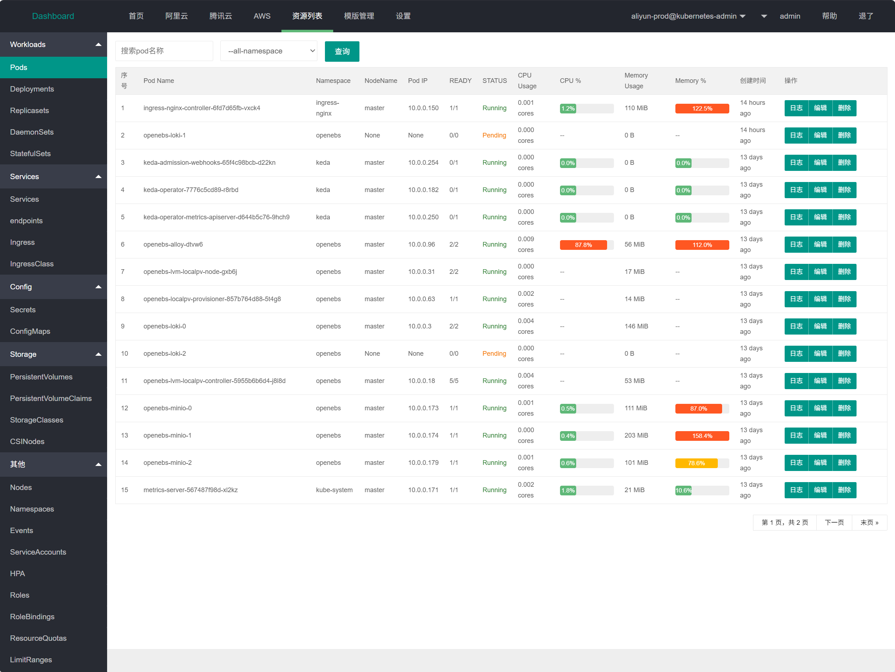
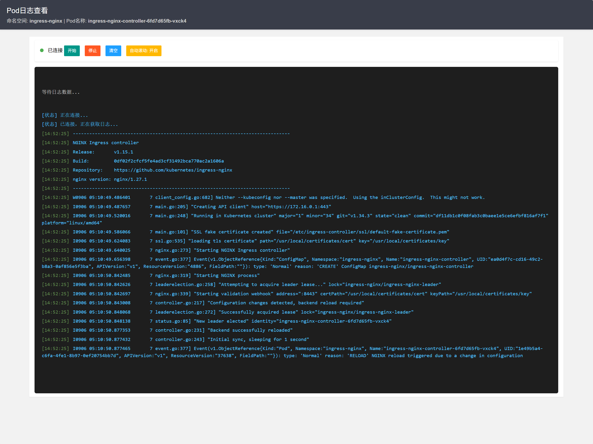
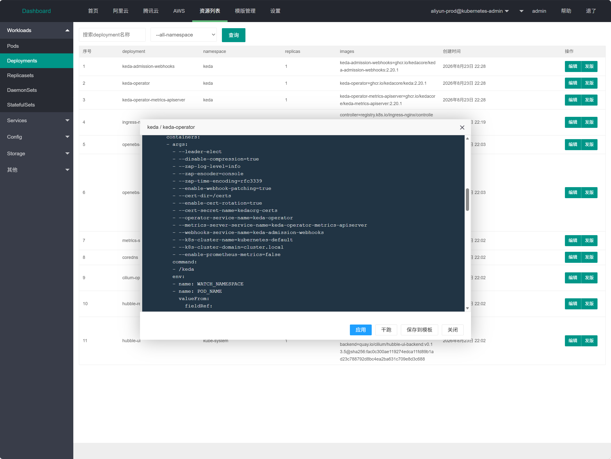
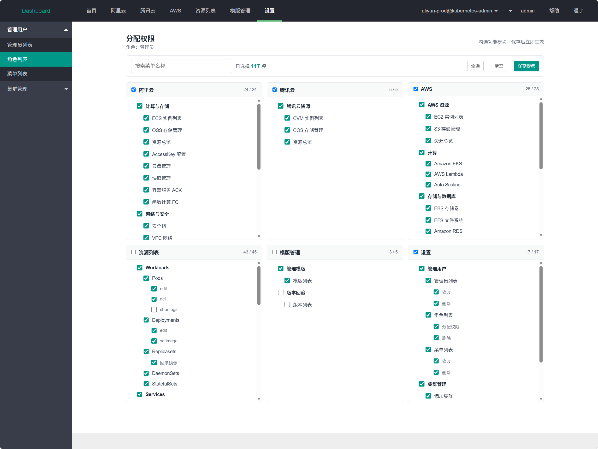
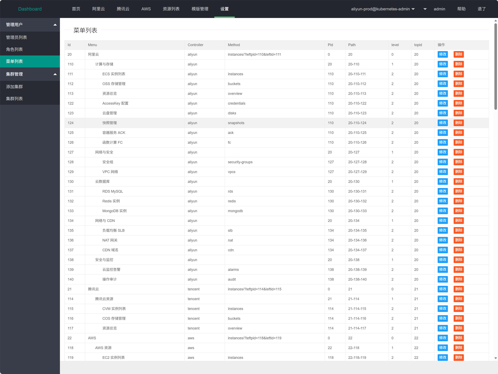
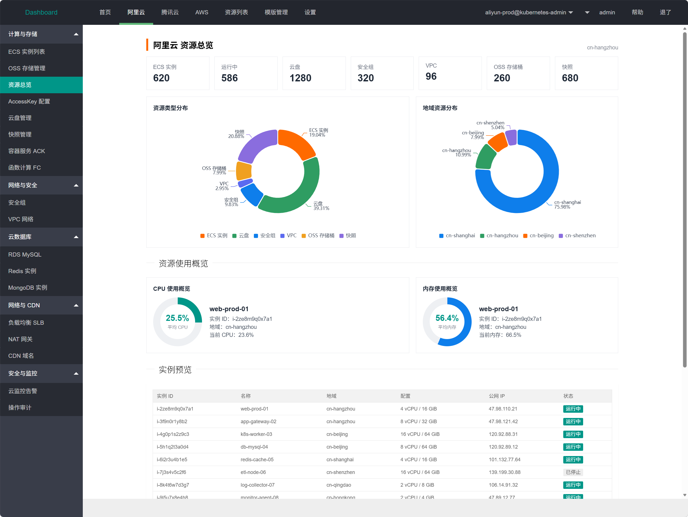
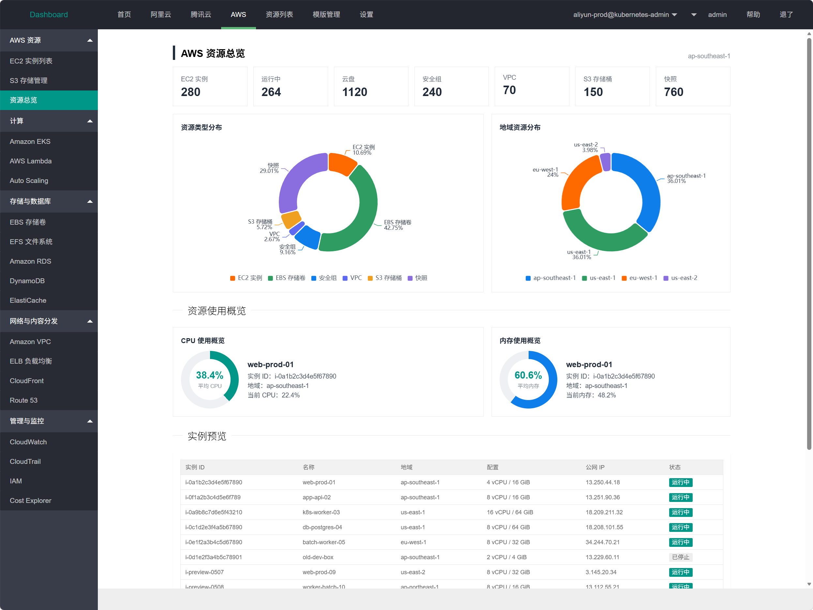

# MultiCloud-Dashboard（手搓项目）

基于 Django 的 Kubernetes 集群管理平台，同时提供阿里云、腾讯云、AWS 等多云资源总览能力。

## 功能预览

### 首页资源总览

首页集中展示多云资源分布、Kubernetes 集群节点、CPU 与内存使用情况。



### Kubernetes 集群资源切换

支持在 Kubernetes 集群之间切换，并查看不同集群中的资源列表。



### Pod 资源列表

展示 Pod 名称、命名空间、节点、IP、Ready 状态、CPU 与内存使用率等信息。



### Pod 日志查看

通过 WebSocket 实时查看 Pod 日志，便于在线排查应用问题。



### Deployment 资源编辑

支持在线查看和编辑 Deployment、Pod 等 Kubernetes 资源的 YAML。



### RBAC 权限管理

支持角色管理、菜单授权和权限分配，页面按功能模块分组展示。



### 菜单管理

可视化维护顶部导航、左侧菜单以及菜单层级关系。



### 阿里云资源总览

展示阿里云 ECS、云盘、安全组、VPC、OSS、快照等资源占比与地域分布。



### AWS 资源总览

展示 AWS EC2、EBS、安全组、VPC、S3、快照等资源占比与地域分布。



## 快速开始

### 1. 安装依赖

```bash
conda create -n k8sdashboard-django python=3.6.8 -y
conda activate k8sdashboard-django

pip install django==3.2.25
pip install -r requirements.txt
```

### 2. 初始化数据库

```bash
python manage.py makemigrations
python manage.py migrate
```

如需初始化多云导航菜单，可执行：

```bash
python manage.py seed_multicloud
```

### 3. 启动服务

使用 Daphne 启动 ASGI 服务：

```bash
daphne -b 0.0.0.0 -p 8000 dashboard.asgi:application
```

或使用 Django 自带的开发服务器：

```bash
python manage.py runserver
```

启动后访问：

- 登录页：http://127.0.0.1:8000/login/

默认管理员账号：

- 用户名：`admin`
- 密码：`admin`

## 常用配置

### MySQL 数据库

```bash
pip install pymysql
```

在 Django 初始化文件中启用 PyMySQL：

```python
import pymysql
pymysql.install_as_MySQLdb()
```

### 模板配置

在 `settings.py` 中配置模板目录：

```python
TEMPLATES = [
    {
        "BACKEND": "django.template.backends.django.DjangoTemplates",
        "DIRS": [os.path.join(BASE_DIR, "templates")],
        "APP_DIRS": True,
        "OPTIONS": {
            "context_processors": [
                "django.template.context_processors.debug",
                "django.template.context_processors.request",
                "django.contrib.auth.context_processors.auth",
                "django.contrib.messages.context_processors.messages",
            ],
        },
    },
]
```

## 目录结构

```text
.
├── .gitignore
├── .gitlab-ci.yml
├── Dockerfile
├── manage.py
├── README.md
├── requirements.txt
├── dashboard/                 # Django 项目配置
│   ├── asgi.py
│   ├── context.py
│   ├── settings.py
│   ├── urls.py
│   └── wsgi.py
├── images/                    # README 截图
├── k8sdashboard/              # Kubernetes 与多云管理业务代码
│   ├── management/commands/   # Django 管理命令
│   ├── migrations/            # 数据库迁移
│   ├── templates/             # 页面模板
│   ├── templatetags/          # 模板标签
│   ├── urls/                  # 路由
│   └── utils/                 # K8s 与日志工具
├── static/                    # 静态资源
│   ├── css/
│   ├── js/
│   └── layui/
```
